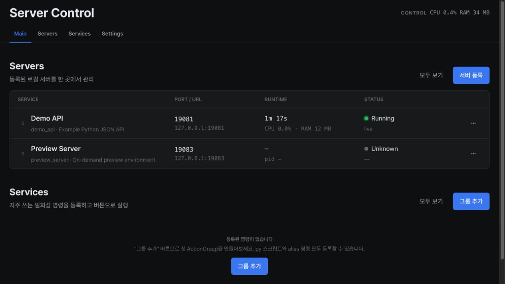

# Control Server

로컬에서 실행하는 여러 서버와 일회성 명령을 한 화면에서 관리하는 macOS용 웹
컨트롤러입니다. 시작·중지·재시작, HTTP/TCP health, 로그 스트리밍, 프로세스 트리
CPU/RSS, YAML 설정 편집과 작업 실행을 지원합니다.

localhost, 신뢰된 LAN 또는 사설 Tailscale 환경을 전제로 합니다.
[보안 정책](SECURITY.md)을 확인하세요.



## 설치

macOS 13 이상, Node.js 22 이상과 npm, Python 3.10 이상이 필요합니다.

```bash
npx --yes @twkim96/control-server@latest install
npx --yes @twkim96/control-server@latest doctor
npx --yes @twkim96/control-server@latest status
npx --yes @twkim96/control-server@latest open
```

설치기는 `~/.control-server`에 앱 release와 private config/runtime/log, Python venv,
전용 PM2와 사용자 LaunchAgent를 준비합니다. 비밀번호를 지정하지 않으면 초기 값을
한 번 출력합니다. 세부 요구 사항과 충돌 처리는 [설치 안내](docs/operations/install.md)에 있습니다.

현재 checkout의 구현은 1.5.3이며 공개 배포 상태·Intel 수용은 [TODO](docs/TODO.md)에서
관리합니다. `latest`는 공개된 버전이므로 checkout과 같다고 가정하지 않습니다.
기록된 릴리스 결과는 [CHANGELOG](CHANGELOG.md)를 참고하세요.

## 사용과 관리

- **Servers**: 계속 실행할 서버·worker·tunnel. 전용 PM2가 lifecycle을 관리합니다.
- **Services**: 종료되는 update/deploy/scan/build 등의 Action Group. 자체 runner가 실행합니다.
- **Settings**: 외형과 config reload. 설치된 1.5.3은 독립 PM2 엔진 확인·업데이트·복구도 지원합니다.

공개 패키지와 설치된 앱의 CLI를 구분합니다. 현재 공개 버전과 CLI 선택 절차는
[업데이트 안내](docs/operations/updating.md#choose-the-management-cli)가 기준입니다.
위 `@latest install`은 공개 버전을 설치하며 미공개 1.5.3을 가져오지 않습니다.
**검증된 1.5.3이 이미 설치된 기본 home**의 관리 예시는 다음과 같습니다.

```bash
node "$HOME/.control-server/current/bin/control-server.mjs" doctor \
  --home "$HOME/.control-server"
node "$HOME/.control-server/current/bin/control-server.mjs" rollback \
  --home "$HOME/.control-server"
node "$HOME/.control-server/current/bin/control-server.mjs" uninstall \
  --home "$HOME/.control-server"
```

각 명령은 독립 예시입니다. rollback 뒤에는 `current`의 CLI 버전이 바뀌므로 다시
[CLI를 확인](docs/operations/updating.md#choose-the-management-cli)합니다.
PM2 종료 실패 시 보존은 1.5.3 CLI의 보호입니다. 공개 1.5.2 CLI는 실패를 무시하고
제거를 계속할 수 있으므로, 설치된 앱만 보고 `@latest uninstall`을 선택하지 않습니다.

앱 update/rollback은 release 밖의 데이터를 보존합니다. 독립 PM2 엔진과 구버전 app
rollback의 한계는 [업데이트](docs/operations/updating.md), 문제 발생 시 절차는
[복구](docs/operations/recovery.md), 제거 영향은 [제거](docs/operations/uninstall.md)에 있습니다.

## 문서와 개발

[**docs/SPEC.md**](docs/SPEC.md)에서 관련 영역만 읽고
[**docs/TODO.md**](docs/TODO.md)에서 미완료 작업을 확인합니다.

- [개발 환경·실행·검증](docs/development/setup.md)
- [source checkout 운영](docs/operations/source-runtime.md)
- [HTTP API](API.md)와 [표준 서비스 등록](docs/integrations/service-registration.md)
- [Tailscale HTTPS wrapper](docs/integrations/tailscale-https.md)
- [기여 안내](CONTRIBUTING.md), [릴리스 절차](docs/operations/releasing.md)

Backend는 Python/Flask/Waitress/psutil, frontend는 React/TypeScript/Vite입니다.
launchd는 controller, 전용 PM2는 장기 서버, YAML은 정의를 담당합니다.
정확한 의존성과 버전은 각 package manifest와 Python lock을 따릅니다.
